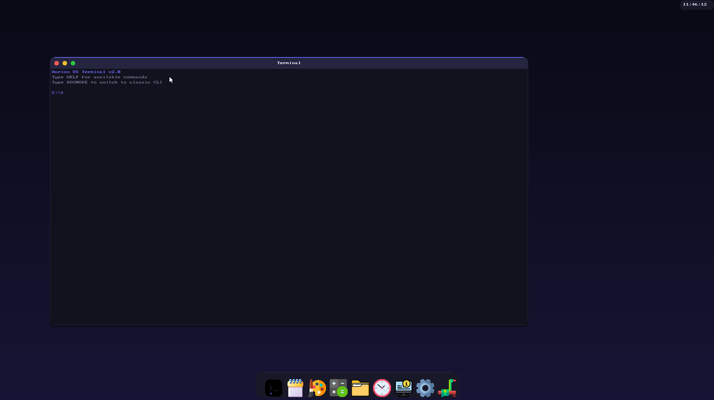
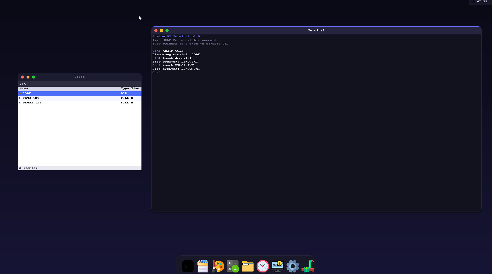
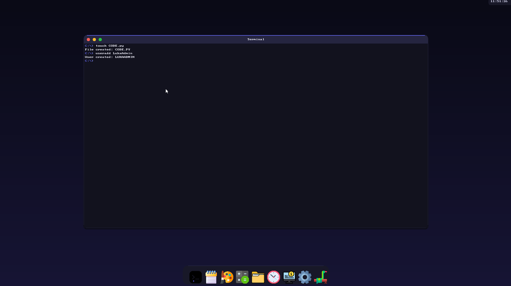
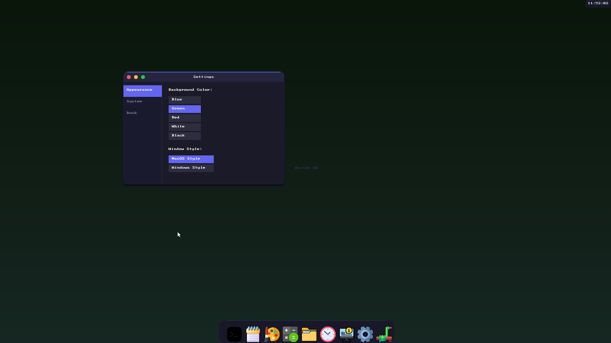
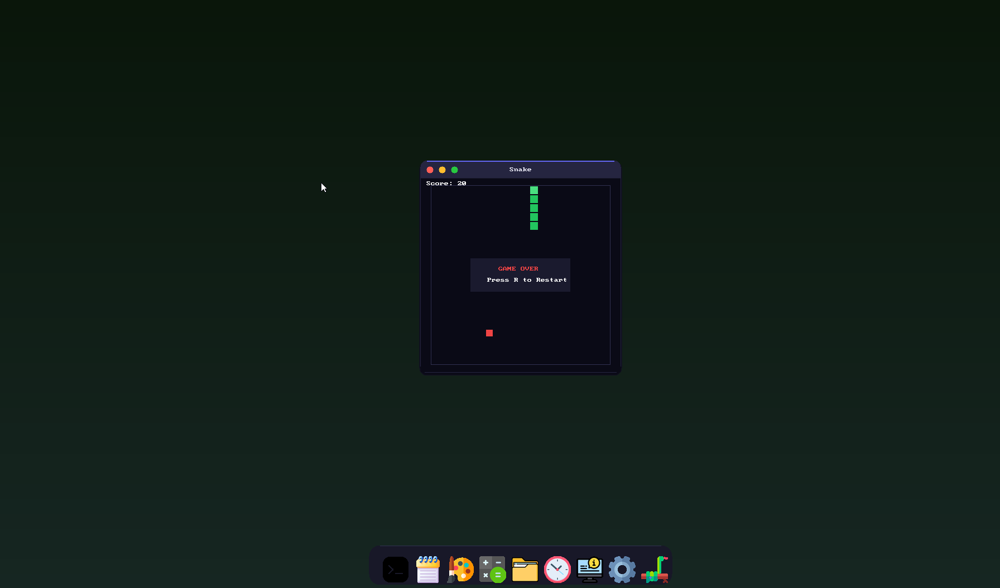

<div align="center">

# AurionOS v1.0 Beta
### The Horizon of Retro-Modern Computing



<div style="height: 20px;"></div>

**AurionOS** A 32-bit x86 operating system built 
from scratch in C and x86 Assembly.
Developed as a solo learning project 
by a 13-year-old over the course 
of 14 days

</div>

<div style="height: 40px;"></div>

## The Vision

AurionOS is built for the tinkerers who want to see every byte move. By stripping away modern abstractions, we reveal the elegant logic of the CPU and the hardware. Every line of code serves a purpose, offering a bloat-free environment for learning and development.

<div style="height: 20px;"></div>

## Gallery

<div align="center">
  
  
  <br>
  
  
  
</div>

<div style="height: 40px;"></div>

## Quick Start: Run the App

1. Ensure you have **QEMU** and **NASM** installed.
2. Run the following command:
   ```bash
   make run
   ```

**Why does this work?**
The Makefile compiles the assembly bootloader and the C kernel, links them at `0x10000`, and packages them into a bootable image. QEMU then loads this image, starting the execution at the BIOS handoff point.

<div style="height: 40px;"></div>

## Deep Dive: How It Works

### 1. The Bootloader (src/bootload.asm)
Starts in 16-bit Real Mode, enables the A20 gate, sets up the GDT, and transitions the CPU to 32-bit Protected Mode before jumping to the kernel.

### 2. The Kernel Entry (src/kernel.asm)
Initializes the stack and the Interrupt Descriptor Table (IDT), then calls the C `kmain` function to begin high-level initialization.

### 3. Memory Management (src/memory.asm)
Uses a Memory Control Block (MCB) heap manager starting at the 1MB mark, providing `kmalloc` and `kfree` for dynamic memory allocation.

### 4. VESA Graphics (src/vesa.asm & src/drivers/vbe_graphics.c)
Utilizes VBE (VESA BIOS Extensions) for high-resolution linear frame buffers. The window manager handles Z-order, clipping, and redrawing.

### 5. Networking (src/tcp_ip_stack.c)
Includes a custom implementation of Ethernet, ARP, IPv4, ICMP, and UDP, alongside a DHCP client for automatic IP configuration.

<div style="height: 40px;"></div>

## Installation Guide

### Windows
Use WSL2 (Ubuntu) for the best experience:
```bash
sudo apt update
sudo apt install -y build-essential nasm gcc make binutils qemu-system-x86 genisoimage
make run
```

### Linux (Ubuntu/Debian)
```bash
sudo apt update
sudo apt install -y build-essential nasm gcc make binutils qemu-system-x86 genisoimage
make run
```

### Linux (Arch)
```bash
sudo pacman -S base-devel nasm gcc make qemu-desktop cdrtools
make run
```

### macOS
```bash
brew install nasm qemu cdrtools make
make run
```

### Recommended
- Build via ```make all```
- Run with VMware or VirtualBox instead of QEMU.

<div style="height: 40px;"></div>

## System Call Interface

AurionOS provides kernel services via `INT 0x80`.

| Syscall ID | Name | Description |
|------------|------|-------------|
| 0x01 | SYS_PRINT_STRING | Print a null-terminated string to console. |
| 0x02 | SYS_PRINT_CHAR | Print a single character. |
| 0x04 | SYS_READ_CHAR | Read a character from keyboard (blocking). |
| 0x05 | SYS_CLEAR_SCREEN | Clear the terminal. |
| 0x08 | SYS_SET_COLOR | Set terminal text attributes. |
| 0x50 | SYS_GET_TIME | Get current CMOS time. |
| 0x51 | SYS_GET_DATE | Get current CMOS date. |
| 0x52 | SYS_GET_TICKS | Get timer ticks since boot. |
| 0x61 | SYS_READ_SECTOR | Read raw disk sector. |
| 0x71 | SYS_SHUTDOWN | Power off the system. |

<div style="height: 40px;"></div>

## The AurionFS Filesystem

AurionOS uses a custom sector-based filesystem (AurionFS) for persistent storage. It stores file metadata in reserved sectors (starting at LBA 500) and file contents in a dedicated data area (starting at LBA 700).

- **In-Memory Cache**: The kernel maintains an `fs_table` for quick access to file metadata.
- **Persistence**: Changes are flushed to disk using `fs_save_to_disk()`.
- **Legacy Support**: A FAT12 driver (`src/filesys.asm`) is also available for reading external media.

<div style="height: 40px;"></div>

## The Command Shell (src/shell.c)

The shell is the primary CLI interface, supporting over 100 commands. Commands are dispatched via a central table in `src/commands.c`.

### Key Commands:
- `DIR`: List files in the current directory.
- `CAT <file>`: View file contents.
- `NANO <file>`: Edit text files.
- `NETSTART`: Initialize networking and DHCP.
- `GUIMODE`: Switch to the graphical desktop.
- `PYTHON`: Launch the minimal Python interpreter.

<div style="height: 40px;"></div>

## Writing Your First AurionOS Command

To add a new command to the OS, you don't need a separate binary - simply register it in the kernel:

1. **Implement the command** in `src/commands.c`:
   ```c
   static int cmd_demo(const char *args) {
       puts("Hello, AurionOS World!\n");
       return 0;
   }
   ```
2. **Register it** in the `commands[]` table at the end of `src/commands.c`:
   ```c
   static const Command commands[] = {
       ...
       {"DEMO", cmd_demo},
       {NULL, NULL}
   };
   ```
3. **Compile and Run**: Run `make run` and type `DEMO` in the shell.

<div style="height: 40px;"></div>

## Project Roadmap

- [x] **NANO Text Editor**: A built-in CLI text editor.
- [x] **Python Interpreter**: Minimal support for scripts and expressions.
- [ ] **Sound Driver**: Support for PC Speaker and SB16.
- [ ] **USB Stack**: Drivers for HID devices.

<div style="height: 40px;"></div>

## Known Issues

- Real hardware boot is currently 
  unstable (working on it!)
- Best experience: QEMU, VirtualBox, 
  or VMware
- This is a beta release - bugs
  are expected and being fixed

## License

AurionOS is licensed under the **MIT License**.

---

**AurionOS** - *Where Every Byte Matters*
Built with passion by Luka.
March 2026.