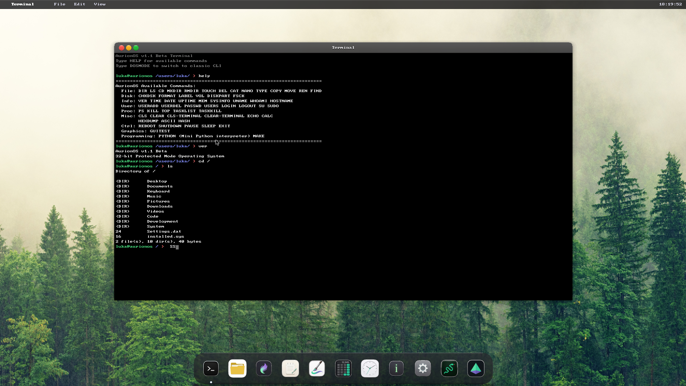
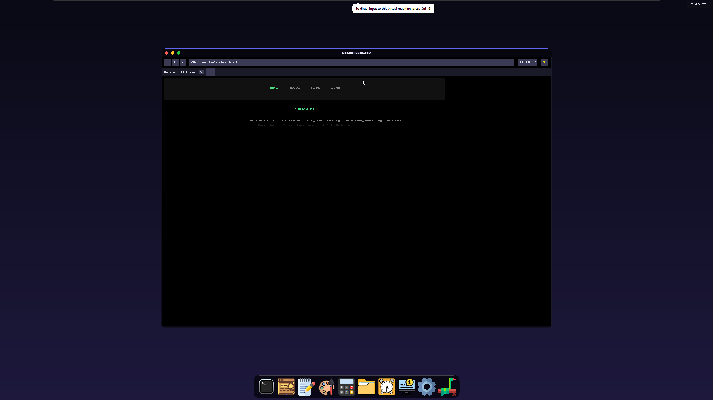
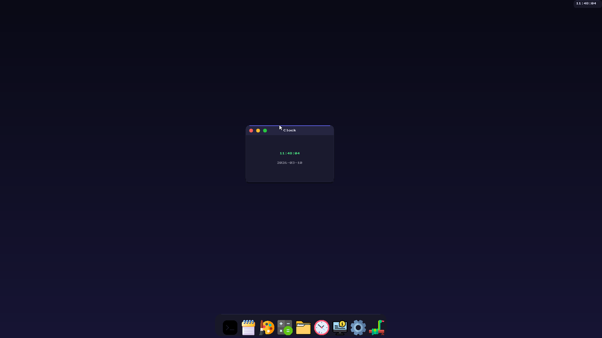
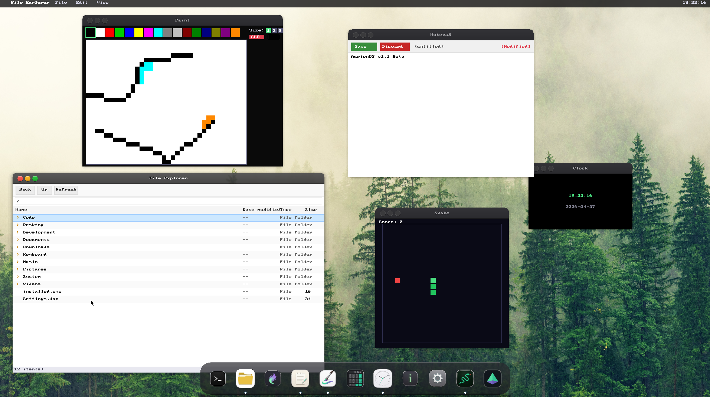
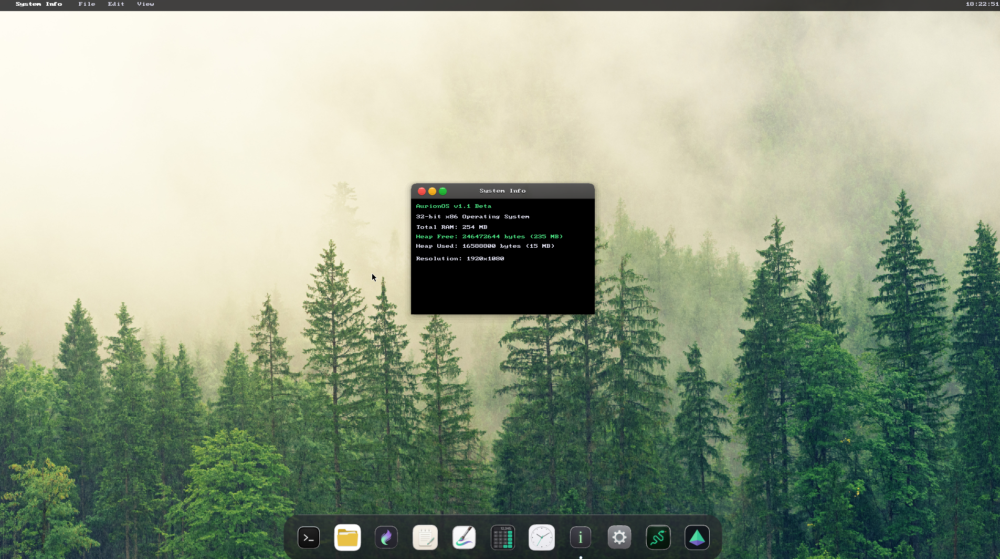
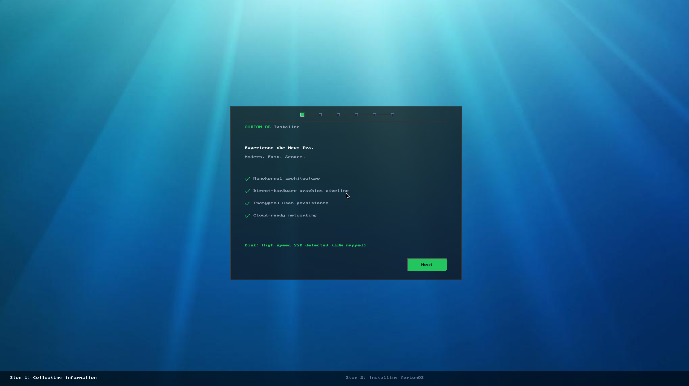

<div align="center">

# AURION OS

### A Modern Operating System Built From Scratch

**Pure Speed. Zero Compromise. 1.1 Beta**

[Features](#features) • [Screenshots](#screenshots) • [Quick Start](#quick-start) • [Building](#building) • [Documentation](#documentation)

[Try AurionOS online](https://aurionos.vercel.app)

---

</div>

## What is AurionOS?

AurionOS is a complete operating system written from the ground up in x86 assembly and C. No Linux kernel. No POSIX. No borrowed code. Every line - from the bootloader to the desktop environment - was built to prove that modern, usable operating systems can still be created by individuals who care about understanding how computers actually work.

This is not a toy. This is a statement that software can be fast, beautiful, and uncompromising.

### The Vision

Operating systems have become bloated, opaque, and inaccessible. AurionOS rejects that trend. It is:

- **Fast** - Boots in seconds, responds instantly, wastes nothing
- **Transparent** - Every component is readable, understandable, modifiable
- **Complete** - GUI, networking, filesystem, applications - everything you need
- **Real** - Runs on actual hardware, not just emulators

---

## Features

### Desktop Environment

- Modern windowed GUI with taskbar and menu bar
- Drag-and-drop window management
- Multiple resolution support (800x600 to 2560x1440)
- Desktop icons with file operations
- Smooth mouse cursor with acceleration
- Login screen with user authentication
- Custom wallpaper support
- Clean, responsive interface

### Applications

**Blaze Browser**

- Custom HTML/CSS/JavaScript engine
- Bookmark management
- Tab browsing
- Local file viewing
- HTTP/HTTPS support

**Productivity**

- Terminal with full command-line interface
- Notepad text editor
- File Manager with tree view
- Calculator (standard and scientific)
- System Information viewer

**Graphics**

- Paint application with drawing tools
- Color picker and palette
- Pixel-perfect rendering
- 3D Demo - Real-time 3D graphics showcase

**Games**

- Snake with scoring and speed levels

### System Features

**Dual Mode Operation**

- GUI Mode - Full desktop environment
- DOS Mode - Classic command-line interface
- Switch between modes with DOSMODE/GUIMODE commands

**Storage**

- Custom filesystem with persistence
- ISO 9660 CD-ROM support
- FAT32 support (experimental)
- File and directory operations
- Configuration storage
- Application data management

**Developer Tools**

- AurionPython interpreter (Python 3.14 implementation)
- Make build system
- Text processing utilities
- Network testing tools

**3D Graphics**

- AurionGL - OpenGL-inspired 3D API
- Software rasterization with z-buffering
- Perspective-correct texture mapping
- Lighting system (up to 4 lights)
- Matrix transformation stack
- Immediate mode rendering

---

## Screenshots

### Desktop Environment



### Blaze Browser



### DOS Mode



### Applications



### System Info



### Installer



---

## Quick Start

### Running in QEMU

```bash
# Linux/macOS
qemu-system-i386 -cdrom build/aurionos.iso -boot d -m 512M

# Windows (PowerShell)
qemu-system-i386 -cdrom build\aurionos.iso -boot d -m 512M

# Via Make
make run
```

### Running in VMware (recommended)

1. Create new VM: "Other" → "Other (32-bit)"
2. Add CD-ROM: Point to `build/aurionos.iso`
3. Add Hard Disk: Point to `build/aurionos_hdd.img` (for persistence)
4. Set firmware to BIOS (not UEFI)
5. Boot from CD-ROM first time, then from HDD

### Running in VirtualBox

1. Create new VM: Type "Other", Version "Other/Unknown (32-bit)"
2. Storage: Add `build/aurionos.iso` as optical drive
3. Storage: Add `build/aurionos_hdd.img` as hard disk (for persistence)
4. System: Enable I/O APIC
5. Boot order: Optical first, then Hard Disk

### First Boot

1. System boots to installer
2. Follow setup wizard:
   - Select applications to install
   - Choose keyboard layout
   - Click "Install"
3. After installation, click "Reboot"
4. System boots to desktop

### Switching Modes

- **GUI → DOS**: Open Terminal, type `DOSMODE`
- **DOS → GUI**: Type `GUIMODE` at prompt

---

## Building from Source

### Prerequisites

**Linux/macOS:**

```bash
# Ubuntu/Debian
sudo apt install build-essential nasm qemu-system-x86 xorriso

# Arch Linux
sudo pacman -S base-devel nasm qemu xorriso

# macOS
brew install nasm qemu xorriso
brew install i686-elf-gcc  # Cross-compiler
```

**Windows:**

```powershell
# Install WSL2 (Ubuntu)
wsl --install

# Inside WSL - Install 32-bit development libraries (REQUIRED for building)
sudo dpkg --add-architecture i386
sudo apt update
sudo apt install libc6-dev-i386 gcc-multilib g++-multilib build-essential nasm qemu-system-x86 xorriso
```

### Build Commands

```bash
# Clone repository
git clone https://github.com/Luka12-dev/AurionOS.git
cd AurionOS

# Build everything (Linux/macOS)
make all

# Build everything (Windows)
wsl make all
```

### Build Output

- `build/kernel.bin` - Kernel binary
- `build/bootload.bin` - Bootloader
- `build/aurionos.img` - Floppy image
- `build/aurionos.iso` - Bootable ISO
- `build/aurionos_hdd.img` - Hard disk image with persistence

### Build System Explained

The Makefile orchestrates the entire build:

1. **Bootloader** (src/bootload.asm) - NASM assembles to 512-byte boot sector
2. **Kernel** (src/*.asm, src/*.c) - GCC compiles C, NASM assembles ASM, links to flat binary
3. **Icons** (icons/*.rle) - Python script converts .bmp to RLE format
4. **Images** - Python scripts create floppy, ISO, and HDD images

The build is deterministic - same source always produces same binary.

---

## Architecture

### Boot Process

```
BIOS → Bootloader (512 bytes)
  ↓
Load Kernel from disk
  ↓
Switch to Protected Mode (32-bit)
  ↓
Initialize: IDT, PIC, Memory, Drivers
  ↓
Check boot_mode_flag
  ↓
├─ GUI Mode: VESA graphics → Desktop
└─ DOS Mode: VGA text → Shell
```

### Memory Layout

```
0x00000000 - 0x000003FF : Real Mode IVT
0x00000400 - 0x000004FF : BIOS Data Area
0x00000500 - 0x00007BFF : Free (bootloader stack)
0x00007C00 - 0x00007DFF : Bootloader (512 bytes)
0x00007E00 - 0x0000FFFF : Free
0x00010000 - 0x0006FFFF : Kernel (loaded here)
0x00070000 - 0x0009FFFF : Free
0x000A0000 - 0x000BFFFF : VGA memory
0x000C0000 - 0x000FFFFF : BIOS ROM
0x00100000+             : Extended memory (heap)
```

### Component Structure

```
AurionOS/
├── src/
│   ├── bootload.asm       # Bootloader
│   ├── kernel.asm         # Kernel entry
│   ├── memory.asm         # Memory management
│   ├── interrupt.asm      # IDT and ISRs
│   ├── io.asm             # VGA text I/O
│   ├── vesa.asm           # VESA mode setup
│   ├── desktop.c          # Desktop environment
│   ├── window_manager.c   # Window management
│   ├── shell.c            # DOS mode shell
│   ├── commands.c         # Shell commands
│   ├── gui_apps.c         # GUI applications
│   ├── terminal.c         # Terminal app
│   ├── installer.c        # Setup wizard
│   ├── Blaze/             # Browser engine
│   └── drivers/           # Hardware drivers
├── include/               # Header files
├── icons/                 # Application icons
├── tools/                 # Build scripts
└── build/                 # Output directory
```

---

## Command Reference

### Commands

**System**

- `HELP` - Show available commands
- `VER` - Display version
- `CLS` / `CLEAR` - Clear screen
- `GUIMODE` - Switch to GUI
- `REBOOT` - Restart system

**Files**

- `LS` / `DIR` - List files
- `CD <dir>` - Change directory
- `MKDIR <name>` - Create directory
- `RM <file>` - Delete file
- `CAT <file>` - Display file
- `EDIT <file>` - Edit file

**Development**

- `PYTHON` - Start AurionPython interpreter (Python 3.14)
- `MAKE` - Run build system
- `GREP <pattern> <file>` - Search text

---

## Hardware Compatibility

### Tested Platforms

| Platform | Status | Notes |
|----------|--------|-------|
| QEMU | Full Support | Recommended for development |
| VMware Workstation | Full Support | SVGA acceleration works |
| Real Hardware (PS/2) | Full Support | Tested on one PC |
| Real Hardware (USB) | Partial | Depends on controller |

### Graphics

- **VESA VBE** - Primary graphics mode
- **Bochs VBE** - Emulator-specific extensions
- **VMware SVGA** - Hardware acceleration in VMware
- **VGA Text Mode** - 80x25 for DOS mode

### Input Devices

- **PS/2 Keyboard** - Full support
- **PS/2 Mouse** - Full support with wheel
- **USB Mouse** - UHCI, OHCI, EHCI, xHCI
- **VMware VMMouse** - Absolute positioning

---

## Development

### Project Structure

The codebase is organized by function:

- **Boot** - Bootloader and early initialization
- **Kernel** - Core system services
- **Drivers** - Hardware abstraction
- **GUI** - Desktop and window manager
- **Apps** - User applications
- **Network** - TCP/IP stack
- **Filesystem** - Storage management
- **Tools** - Build scripts (mkfloppy.py, mkiso.py, mkhdd.py, build_bootloader.py)
- **Icons** - Pre-converted .rle icon files (convert_icons.py not needed for building)

### Coding Standards

- Assembly: NASM syntax, Intel style
- C: C11 standard, freestanding
- No standard library - everything custom
- Comments explain WHY, not WHAT
- Consistent naming: snake_case for functions, PascalCase for types

### Adding Applications

1. Create app in `src/gui_apps.c`
2. Add icon to `icons/bmp/`
3. Register in desktop app list
4. Rebuild with `make`

### Contributing

This is a personal project, but if you want to:

1. Fork the repository
2. Create a feature branch
3. Make your changes
4. Test thoroughly (QEMU, VMware, VirtualBox)
5. Submit a pull request

Focus on:

- Performance improvements
- Hardware compatibility
- Bug fixes
- Documentation

---

## Troubleshooting

### Build Issues

**"nasm: command not found"**

```bash
# Install NASM assembler
sudo apt install nasm  # Ubuntu/Debian
```

**"i686-elf-gcc: command not found"**

```bash
# Use system GCC with -m32 flag (already configured in Makefile)
sudo apt install gcc-multilib
```

**"Make fails on Windows"**

```bash
# Always use WSL
wsl make
```

### Runtime Issues

**Black screen on boot**

- Try different resolution in VM settings
- Ensure BIOS mode (not UEFI)
- Check that ISO/HDD are properly attached

**Mouse not working**

- Enable USB controller in VM
- Try PS/2 mouse instead
- Check mouse integration settings

**Network not working**

- Run `NETSTART` command
- Check network adapter type (use NE2000 or RTL8139)
- Verify DHCP server is available

**Keyboard layout wrong**

- Run installer and select correct layout
- Or edit config file in filesystem

---

## Performance

### Boot Time

- Cold boot to desktop: ~3 seconds (QEMU)
- Mode switch (GUI ↔ DOS): ~1 second

### Memory Usage

- Kernel: ~400 KB
- Desktop environment: ~2 MB
- Per application: ~100-500 KB
- Minimum RAM: 16 MB
- Recommended RAM: 512 MB

### Disk Usage

- ISO image: ~1.8 MB
- With user data: Varies

---

## Try It Online

Experience AurionOS directly in your browser without any installation:

**Live Demo**: [https://aurionos.vercel.app](https://aurionos.vercel.app)

The web version runs through v86 emulation. For the best performance, download and run on VirtualBox or VMware.

---

## Acknowledgments

### Icon Credits

Application icons are sourced from [Flaticon](https://www.flaticon.com). We appreciate the talented designers who make quality icons freely available.

---

## License

See LICENSE file for details.

---

## Credits

Built by a developer who believes operating systems should be understandable, not mysterious black boxes.

Special thanks to:

- OSDev community for documentation
- NASM and GCC teams for excellent tools
- Everyone who said "you can't build an OS alone" - you were wrong

---

## Links

- **Changelog**: See CHANGELOG.md for version history
- **Issues**: [Issues](https://github.com/Luka12-dev/AurionOS/issues)

---

<div align="center">

**AurionOS 1.1 Beta**

*Built with passion. Runs with purpose.*

---

</div>
